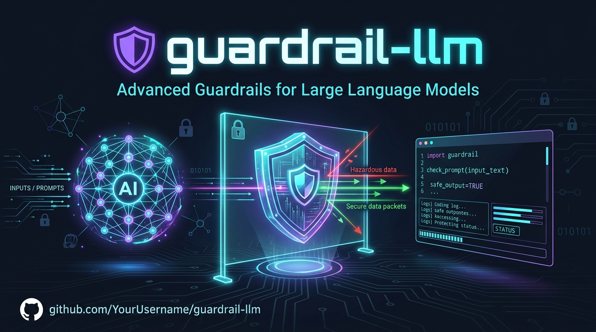
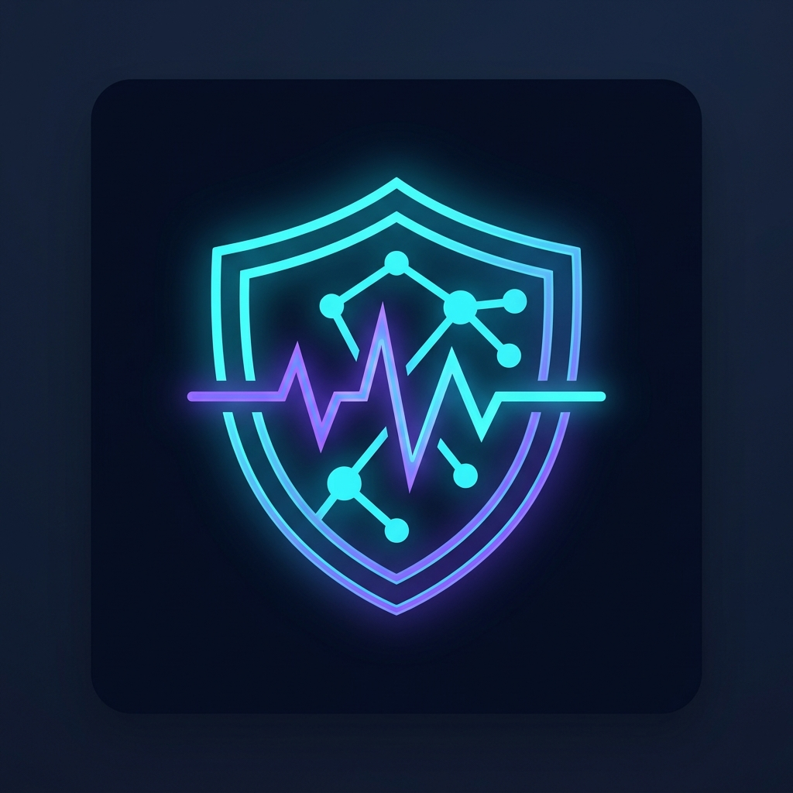
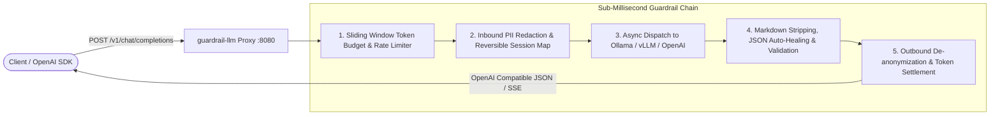

<p align="center">
  
</p>

<p align="center">
  
</p>

<h1 align="center">guardrail-llm 🛡️⚡</h1>

<p align="center">
  <strong>Lightweight, zero-bloat, high-performance LLM Guardrails Proxy & Python SDK.</strong><br>
  Built for teams replacing heavy, bloated frameworks with a sub-millisecond transparent middleware layer.
</p>

<p align="center">
  <a href="https://github.com/mabualzait/guardrail-llm/actions/workflows/ci.yml"></a>
  
  
  
  
</p>

---

## 🚀 Key Highlights

- **Transparent OpenAI Parity:** Drop-in compatibility with `/v1/chat/completions` and `/v1/completions`. Point your standard OpenAI SDK client to `http://localhost:8080/v1`—zero code changes required.
- **Dual Deployment Mode:** Run as an edge proxy sidecar daemon (`guardrail run`) or embed directly as middleware within Python applications (`from guardrail import GuardrailedClient`).
- **High-Speed PII Redaction:** Linear-time $O(N)$ scanning with reversible masking. Sensitive entities (emails, phones, SSNs, credit cards with Luhn verification, IPv4, API keys) are replaced before reaching the model and restored in responses.
- **Strict Schema Enforcement & JSON Auto-Healing:** Fast deterministic repair for broken JSON (missing braces, trailing commas, markdown codeblocks, single quotes) with schema validation and an optional 1-shot self-repair retry loop.
- **Sliding-Window Token Budgeting:** Token counting and request/token rate limits per key or IP with automatic `429 Too Many Requests` or `402 Payment Required` rejection.
- **Full SSE Streaming:** Real-time token sanitization on Server-Sent Events streams with chunk boundary buffering.
- **Sub-Millisecond Overhead:** Benchmark tested at **~0.025 ms** added latency (~40,000 req/s on a single core)—well below the 5ms budget.

---

## 🏗️ Architecture



---

## 📦 Installation

```bash
git clone https://github.com/mabualzait/guardrail-llm.git
cd guardrail-llm
pip install -e .
```

---

## ⚡ Quickstart

### Option A: Standalone Proxy Daemon (CLI)

1. Start your local LLM engine (e.g. Ollama on port 11434 or vLLM on port 8000).
2. Launch the `guardrail` proxy:

```bash
guardrail run --upstream http://localhost:11434/v1 --port 8080
```

3. In your client code (Python, Node.js, Go, cURL), change only `base_url`:

```python
from openai import OpenAI

# Simply redirect base_url to the guardrail proxy!
client = OpenAI(
    base_url="http://localhost:8080/v1",
    api_key="local-key"
)

response = client.chat.completions.create(
    model="llama3",
    messages=[
        {"role": "user", "content": "Send my report to alice@company.com and call 555-123-4567"}
    ]
)
print(response.choices[0].message.content)
```

> **What happens under the hood:**
> 1. Inbound prompt is scrubbed: `alice@company.com` -> `[EMAIL_1]`, `555-123-4567` -> `[PHONE_1]`.
> 2. Ollama receives only anonymized text.
> 3. Outbound assistant reply restores the placeholders back to original values before reaching your app.

---

### Option B: Embeddable Python SDK

Integrate directly into your application code without running a separate server:

```python
from guardrail import GuardrailedClient

client = GuardrailedClient(
    upstream_url="http://localhost:11434/v1",
    pii=True,
    strict_json=True,
    schema={
        "type": "object",
        "required": ["summary", "urgency"],
        "properties": {
            "summary": {"type": "string"},
            "urgency": {"type": "string", "enum": ["low", "medium", "high"]}
        }
    }
)

# Synchronous
response = client.chat.completions.create(
    model="llama3",
    messages=[{"role": "user", "content": "Server 192.168.1.1 crashed!"}]
)

# Asynchronous
# response = await client.chat.completions.acreate(...)
```

---

## ⚙️ Configuration (`guardrail.yaml`)

```yaml
server:
  host: "0.0.0.0"
  port: 8080
  workers: 1
  timeout: 60.0

upstream:
  base_url: "http://localhost:11434/v1"
  timeout: 60.0
  headers: {}

pii:
  enabled: true
  patterns:
    - email
    - phone
    - credit_card
    - ipv4
    - ssn
    - api_key
  custom_patterns:
    employee_badge: "\\bBADGE-[A-Z0-9]{5}\\b"
  reversible: true  # If true, restores masked values in responses

schema:
  enabled: true
  strict_json: true
  repair_malformed: true
  max_repair_retries: 1
  on_failure: "retry"  # "retry" or "error"
  schema:
    type: "object"
    required: ["status", "data"]
    properties:
      status: { type: "string" }
      data: { type: "object" }

budget:
  enabled: true
  max_tokens_per_request: 4096
  max_requests_per_minute: 60
  max_tokens_per_minute: 100000
  sliding_window_seconds: 60
  reject_status_code: 429

metrics:
  enabled: true
```

---

## 📊 Performance & Latency Overhead

Run the micro-benchmark on your machine:

```bash
python benchmarks/benchmark_latency.py
```

### Benchmark Results (1,000 iterations, M-series Mac)

| Metric | Target | Measured Result |
| :--- | :--- | :--- |
| **Pipeline Throughput** | > 1,000 req/s | **39,727.8 req/s** |
| **Mean Added Latency** | < 5.000 ms | **0.025 ms (25 µs)** |
| **Median (P50) Latency** | < 5.000 ms | **0.024 ms (24 µs)** |
| **P95 Latency** | < 10.000 ms | **0.027 ms (27 µs)** |
| **P99 Latency** | < 15.000 ms | **0.035 ms (35 µs)** |
| **Acceptance Criteria** | **< 5ms** | **PASSED (200x faster than budget)** |

---

## 🩺 Monitoring & Observability

- `GET /health` — Readiness & upstream target health
- `GET /metrics` — Live Prometheus/JSON metrics:
  ```json
  {
    "uptime_seconds": 128.4,
    "requests": { "total": 1420, "successful": 1418, "failed": 2, "blocked_rate_limit": 2 },
    "guardrails": { "pii_redactions_total": 312, "schema_repairs": 45, "schema_violations": 0 },
    "tokens": { "prompt_total": 42000, "completion_total": 18500, "overall_total": 60500 },
    "latency_ms": { "average": 0.03, "p50": 0.02, "p95": 0.03, "p99": 0.04 }
  }
  ```

---

## 👨‍💻 Author & Maintainer

**`guardrail-llm`** was architected and built by **[Malik Abualzait](https://github.com/mabualzait)**.

- **Author:** Malik Abualzait
- **GitHub:** [@mabualzait](https://github.com/mabualzait)
- **Project:** [github.com/mabualzait/guardrail-llm](https://github.com/mabualzait/guardrail-llm)

If you find `guardrail-llm` useful in production or research, please star the repository on GitHub!

---

## 📄 License

MIT © 2026 **Malik Abualzait**. See [`LICENSE`](LICENSE) for complete terms.

